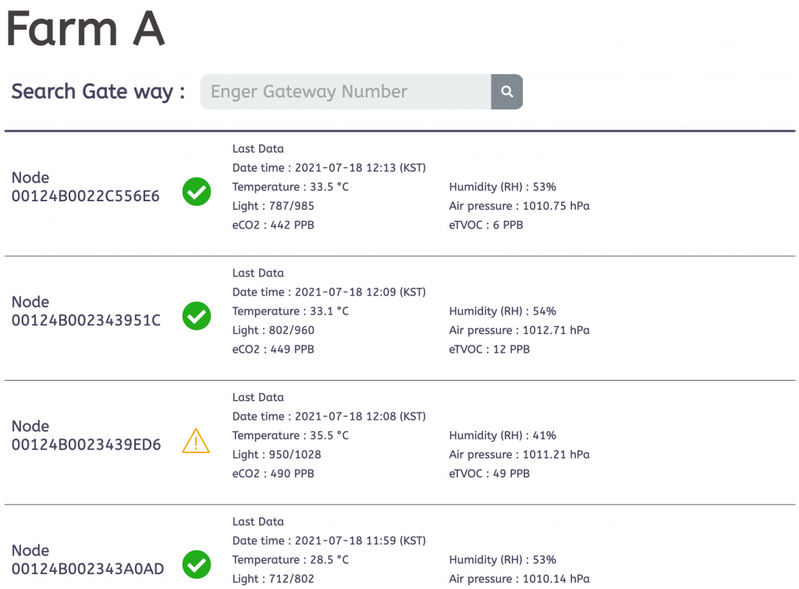

# Sub-G Smart Agriculture

---

 

<table>
<tr align="center">
  <td> TOP </td>
  <td> BOTTOM </td>
</tr>
  <tr align="center">
    <td></td>
    <td></td>
  </tr>
</table>

----

"Sub-G Smart Agriculture" uses AxDen's Aggregator Platform to collect key sensor information necessary for Smart Agriculture such as temperature, barometric pressure, and illuminance.
 
This is an example that provides quick testing of various service scenarios that require long-distance communication of 1Km or more.
 
 
Related hardware kits can be purchased from the Naver Smart Store.
 
[Purchase Link : naver smart store](https://smartstore.naver.com/axden)
 
 
You can purchase it by contacting sales@axden.io
 

----

### Key features and functions

*\* Low-power technology with TI Sensor Controller is available in the Production version family.*
 

Sensor | Description
:-------------------------:|:-------------------------:
BME280 | Air pressure, temperature sensor
HDC1080 | Humidity, temperature sensor
VCNL4040 | ToF distance, ambient light sensor
Soil moisture sensor | On board

"Sub-G Smart Agriculture" example collects key sensor information required in Smart Agriculture such as temperature, barometric pressure, and illuminance, and transmits it using Sub-G long-distance communication. In conjunction with the AxDen Aggregator Platform, you can check sensor information on the web and mobile without building infrastructure such as servers and DBs, and use the stored sensor information to learn Edge AI.
 
 

----

### **Check via terminal**
 
If you have an adapter board, you can check the communication through the terminal.
 
After connecting the adapter board and the Sub-G Smart Agriculture sensor to the PC, check through serial programs such as screen and putty. (Baudrate is 9600)
 
<table>
  <tr align="center">
    <td>RF rx example terminal</td>
    <td>RF tx example terminal</td>
  </tr>
  <tr align="center">
    <td></td>
    <td></td>
  </tr>
</table>
 

----

### **Check via AXDEN Aggregator platform**
 
Enter COMPANY ID nad DEVCIE ID provided on the AXDEN Aggregator Platform website into COMPANY_ID and DEVCIE_ID in the Protocol.h header file.
 
 

[AXDEN Aggregator Platfrom](http://project.axden.io/)

 

`#define COMPANY_ID 0`

 

`#define DEVICE_TYPE 0`

 
Complie and flash.
 
 
Check whether COMPANY_ID and DEVICE_ID are applied correctly through the terminal
 
 
Sensor information can be found on the Web or Mobile as shown in the image below
 
 

 

----

## Hardware Pinmap
You can check in the board_define.h header file.

----

### [Firmware settings and compilation](https://github.com/AxDen-Dev/CC1312R1_Ping_Pong_example_gcc)

----

### [Firmware flash](https://github.com/AxDen-Dev/CC1312R1_Ping_Pong_example_gcc)
